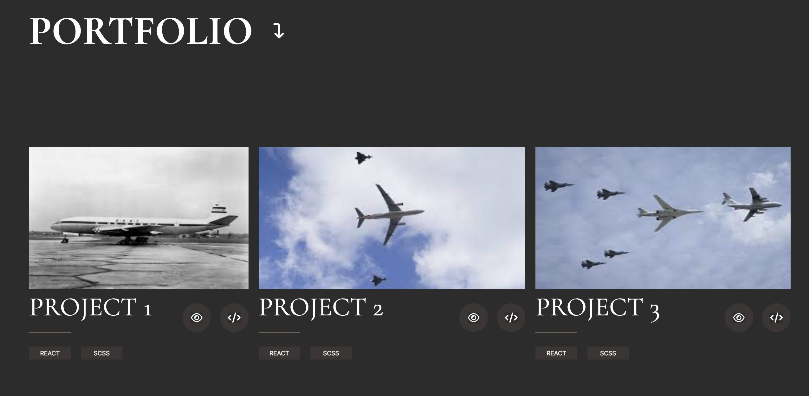

# Welcome to Chris Ko's Web Portfolio

This is my personal webpage showing my coding projects' portfolio. 

Here is the header part of my webpage:

I built my webpage following this sequence: structure, styling and then JavaScript functionalities.

For the portfolio part, I applied Flexbox to layout my projects, and they can wrap to different sizes when the screen changes from desktop, tablet to mobile.

